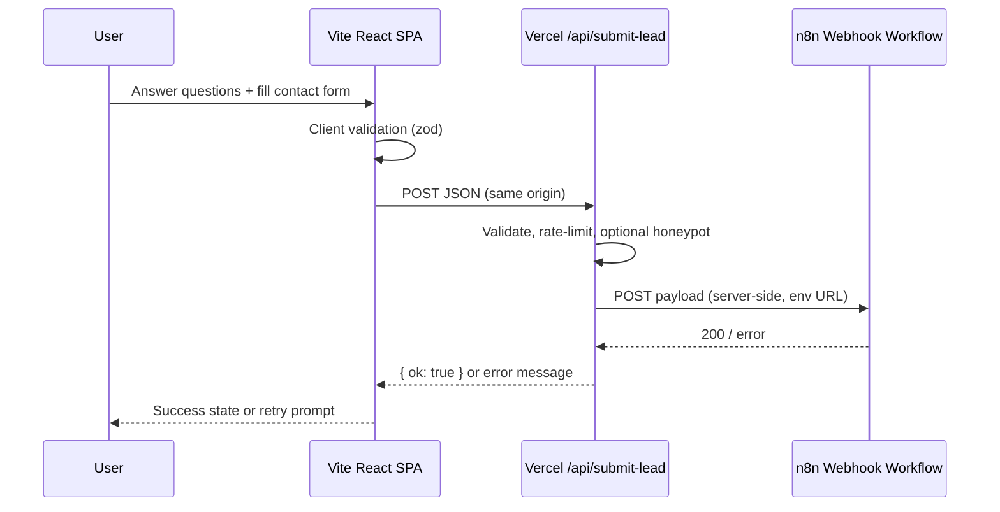

# n8n Webhook Integration — Implementation Plan

Replace the current `mailto:` booking flow with a lead-capture form that posts questionnaire answers and contact details to an **n8n workflow** via a **Vercel serverless API proxy**.

**Status:** Planning  
**Scope:** Frontend form + Vercel API route + env configuration. No admin UI on the site.  
**Out of scope:** n8n workflow build-out (documented here for handoff), CRM setup, email templates inside n8n.

---

## Goals

1. When a user finishes the on-site questions and clicks to **get their roadmap** (or book a discovery call), collect:
   - First name
   - Last name
   - Email address
   - GDPR consent (required checkbox)
   - All questionnaire answers from the session
2. Send that payload to n8n through a server-side proxy (not from the browser).
3. Keep secrets (webhook URL, optional auth token) in **Vercel environment variables** only.
4. Preserve a polished UX: validation, loading state, success/error feedback, accessibility.

---

## Current state (codebase)

| Area | Today |
|------|--------|
| Stack | Vite + React SPA, deployed as static site (no API layer yet) |
| Booking CTAs | `mailto:` links via `src/lib/booking.ts` in `HeroSection`, `ServicesSection`, `MidPageCTA`, `BookingCTA` |
| Questionnaire | **Not implemented yet** — this plan assumes it will be added as part of the same effort |
| Forms infra | `react-hook-form`, `zod`, shadcn `Form` + `Checkbox` already in dependencies |
| Privacy page | Footer links to `/privacy` but no route exists yet |
| Toasts | `sonner` available for submit feedback |

`IMPLEMENTATION_IMPROVEMENTS.md` Phase 3 assumed “frontend only, no backend.” This feature intentionally adds a **thin Vercel serverless layer** — update that doc when implementation is complete.

---

## Target architecture

Browsers cannot call most n8n webhook URLs directly because of **CORS** and because exposing the webhook URL in client code is a security risk (spam, abuse). A Vercel function acts as a trusted relay.



### Why Vercel (not Supabase / direct n8n)

- No database or auth product required — only a single POST relay.
- Fits the existing static Vite deploy model with minimal added surface area.
- Webhook URL never ships to the client bundle.

---

## Suggested improvements (recommended before/during build)

### 1. Fix environment variable name typo

You specified `N8N_WEBOOK_URL`. Recommend **`N8N_WEBHOOK_URL`** (correct spelling) to avoid confusion in Vercel dashboard and docs. If you prefer the original name, use it consistently everywhere — but the typo will cause mistakes later.

### 2. Add optional webhook authentication

n8n supports **Header Auth** on webhook nodes. Add a second env var:

| Variable | Required | Purpose |
|----------|----------|---------|
| `N8N_WEBHOOK_URL` | Yes | Production/test webhook URL from n8n |
| `N8N_WEBHOOK_SECRET` | Recommended | Sent as `X-Webhook-Secret` (or n8n-configured header) — blocks random POSTs to your Vercel endpoint |

The Vercel function should reject requests that do not pass your own lightweight checks; the n8n secret is for the **server → n8n** leg only.

### 3. Two CTA intents, one submission pipeline

Not every “Book a Discovery Call” click should open a mail client:

| CTA location | Suggested behavior |
|--------------|-------------------|
| Hero, header “Book”, mid-page CTA | Scroll to `#roadmap` (questionnaire + lead form) |
| Service cards | Same — anchor to questionnaire |
| Final `#book` section | Host the full form (questions recap + contact fields + submit) |

Keep **one** submit handler and payload shape so n8n always receives the same schema.

### 4. Privacy policy page (GDPR)

GDPR checkbox copy should link to a real policy. Footer already points to `/privacy` — add a static `Privacy` page (or external URL) before go-live. Checkbox label example:

> I agree to the [Privacy Policy](/privacy) and consent to being contacted about my request.

### 5. Spam protection (lightweight)

- **Honeypot** field (`company_website` hidden via CSS) — reject if filled.
- **Server-side zod validation** — never trust the client.
- Optional later: Vercel Firewall / Upstash rate limit per IP if abuse appears.

### 6. Do not add `VITE_N8N_*` variables

Webhook URL must **not** be prefixed with `VITE_` (that embeds it in the client bundle). Only the Vercel function reads `N8N_WEBHOOK_URL`.

---

## Data model

### Client → Vercel (`POST /api/submit-lead`)

```json
{
  "firstName": "Jane",
  "lastName": "Doe",
  "email": "jane@company.com",
  "gdprConsent": true,
  "answers": {
    "companySize": "50-200",
    "primaryChallenge": "manual-ops",
    "timeline": "Q3",
    "budgetRange": "10k-25k"
  },
  "metadata": {
    "source": "action-call-booking",
    "submittedAt": "2026-06-22T12:00:00.000Z",
    "pageUrl": "https://yoursite.com/#book"
  },
  "honeypot": ""
}
```

Adjust `answers` keys to match the actual questionnaire you build. Use stable snake_case or camelCase — pick one and document it for n8n.

### Vercel → n8n

Forward a **superset** of the above (strip `honeypot`). Optionally add:

- `userAgent` (from request headers)
- `ip` (from `x-forwarded-for` — only if you need it for fraud analytics; mention in privacy policy)

### n8n responsibilities (downstream)

Typical workflow nodes (you implement in n8n, not in this repo):

1. Webhook trigger (POST, JSON body)
2. Validate required fields (defense in depth)
3. Branch: GDPR consent must be `true`
4. Send notification email / Slack
5. Append row to Google Sheets / Airtable / CRM
6. Trigger roadmap PDF generation or Calendly follow-up email
7. Error path → internal alert

---

## Environment variables

Configure in **Vercel → Project → Settings → Environment Variables** (Production, Preview, Development).

| Name | Example | Notes |
|------|---------|-------|
| `N8N_WEBHOOK_URL` | `https://your-n8n.app/webhook/abc-123` | From n8n Webhook node |
| `N8N_WEBHOOK_SECRET` | long random string | Optional; must match n8n Header Auth |
| `ALLOWED_ORIGIN` | `https://yourdomain.com` | Optional; restrict CORS on API route |

For **local API development**, use Vercel CLI (`vercel dev`) or a `.env.local` file (gitignored) with the same keys.

---

## Implementation phases

Work in order. Check boxes as you complete each item.

### Phase 0 — Prerequisites

| Task | Done |
|------|------|
| Create n8n workflow with Webhook trigger (POST, JSON) | [x] |
| Note webhook URL; enable Header Auth if using secret | [x] |
| Add env vars in Vercel (and local `.env.local` for dev) | [x] |
| Decide final questionnaire questions + `answers` key names | [x] |
| Draft privacy policy content for `/privacy` | [x] |

### Phase 1 — Vercel API proxy

| Task | Done |
|------|------|
| Add `api/submit-lead.ts` (Vercel serverless function) | [x] |
| Add `vercel.json` — SPA rewrites so React routes work alongside `/api/*` | [x] |
| Validate body with zod (names, email, `gdprConsent === true`, answers object) | [x] |
| Reject honeypot submissions with silent success or 400 (pick one strategy) | [x] |
| `POST` to `process.env.N8N_WEBHOOK_URL` with timeout (~10s) | [x] |
| Return `{ ok: true }` on success; generic error message on failure (no n8n internals leaked) | [x] |
| Set CORS: same-origin only (or `ALLOWED_ORIGIN` for preview deploys) | [x] |

**Suggested file layout:**

```
api/
  submit-lead.ts      # Vercel Node serverless handler
vercel.json           # rewrites + build config
```

**`vercel.json` sketch:**

```json
{
  "rewrites": [
    { "source": "/api/(.*)", "destination": "/api/$1" },
    { "source": "/(.*)", "destination": "/index.html" }
  ]
}
```

Vite `output` remains `dist/` (default). Set Vercel **Output Directory** to `dist` and **Build Command** to `npm run build`.

### Phase 2 — Questionnaire + lead capture UI

| Task | Done |
|------|------|
| Add `RoadmapSection` (or extend `BookingCTA`) with `id="roadmap"` | [x] |
| Multi-step or single-page questionnaire component | [x] |
| Store answers in React state (or `react-hook-form` + context) | [x] |
| Contact step: first name, last name, email, GDPR checkbox | [x] |
| Client-side zod schema mirroring API schema | [x] |
| Submit button: “Get my roadmap” / “Book a discovery call” (align with `primaryCtaLabel`) | [x] |
| Loading disabled state on submit | [x] |
| Success UI (thank you + what happens next) | [x] |
| Error UI via `sonner` toast + inline message | [x] |
| `aria-live` region for screen readers on success/error | [x] |

Reuse existing shadcn primitives: `Form`, `Input`, `Checkbox`, `Button`.

### Phase 3 — CTA wiring

| Task | Done |
|------|------|
| Update `src/lib/booking.ts` — export `#roadmap` anchor; deprecate `bookingMailto` for primary CTAs | [x] |
| `HeroSection`, `ServicesSection`, `MidPageCTA`, `SiteHeader`: link to `#roadmap` instead of `mailto:` | [x] |
| Keep `bookingEmail` for footer “Email” link only | [x] |
| Align button labels across sections | [x] |

### Phase 4 — Privacy & compliance

| Task | Done |
|------|------|
| Add `/privacy` route + static page content | [x] |
| GDPR checkbox cannot submit unless checked | [x] |
| Privacy policy describes: what data is collected, why, retention, contact email, lawful basis | [x] |
| Document in privacy policy that submissions are processed via n8n automation | [x] |

### Phase 5 — Testing & deployment

| Task | Done |
|------|------|
| Unit test: zod schemas (client + shared if extracted) | [x] |
| Manual test: happy path → n8n execution appears | [x] |
| Manual test: invalid email, missing consent, empty answers → 400 | [x] |
| Manual test: honeypot filled → rejected | [x] |
| Manual test: n8n down → user sees friendly error | [x] |
| Preview deploy on Vercel with test webhook URL | [x] |
| Production cutover: swap env to production n8n URL | [x] |
| Update `IMPLEMENTATION_IMPROVEMENTS.md` Phase 3 note (backend proxy added) | [x] |

---

## API contract (for frontend developers)

### `POST /api/submit-lead`

**Request:** `Content-Type: application/json`

**Success:** `200` — `{ "ok": true }`

**Validation error:** `400` — `{ "ok": false, "error": "Invalid request" }` (keep messages generic)

**Server / upstream error:** `502` — `{ "ok": false, "error": "Unable to submit right now. Please try again or email us." }`

**Method not allowed:** `405`

Frontend `fetch` example:

```ts
const res = await fetch("/api/submit-lead", {
  method: "POST",
  headers: { "Content-Type": "application/json" },
  body: JSON.stringify(payload),
});
```

Use a relative URL so it works on production and Vercel preview URLs.

---

## Local development

| Approach | Command | Notes |
|----------|---------|-------|
| **Recommended** | `vercel dev` | Serves Vite + `/api` routes together |
| Frontend only | `npm run dev` | API calls will 404 unless proxied — use for UI-only work |

Add npm script (optional): `"dev:vercel": "vercel dev"`.

---

## Security checklist

- [x] Webhook URL only in server env, never `VITE_*`
- [x] Validate all fields server-side
- [x] `gdprConsent` must be strictly `true`
- [x] Honeypot field present
- [x] No stack traces or n8n response bodies returned to client
- [x] Optional: `N8N_WEBHOOK_SECRET` header on outbound request
- [x] Optional: rate limiting if spam becomes an issue

---

## Open decisions (resolve before Phase 2 UI)

1. **Questionnaire content** — What are the exact questions? (Needed for `answers` schema and copy.)
2. **Single-step vs wizard** — Wizard reduces perceived form length; single page is simpler to build.
3. **Post-submit behavior** — Inline thank-you vs redirect to Calendly vs “check your email”?
4. **Env var name** — Confirm `N8N_WEBHOOK_URL` vs `N8N_WEBOOK_URL`.
5. **Roadmap delivery** — Automated PDF/email from n8n, or manual follow-up within 24h? (Affects success copy.)

---

## Rollback plan

If n8n or the API fails in production:

1. Temporarily point primary CTAs back to `bookingMailto` in `src/lib/booking.ts`.
2. Redeploy frontend-only — no env changes required.
3. Fix API/n8n offline; re-enable form submit.

Keep `bookingMailto` helper in the codebase (commented or feature-flagged) for one-release rollback.

---

## Master checklist

- [x] Phase 0 — Prerequisites (n8n + env + content)
- [x] Phase 1 — Vercel API proxy
- [x] Phase 2 — Questionnaire + lead form UI
- [x] Phase 3 — CTA wiring (remove mailto from primary funnel)
- [x] Phase 4 — Privacy & GDPR
- [x] Phase 5 — Test & deploy

---

## Related files (expected touch points)

| File | Change |
|------|--------|
| `api/submit-lead.ts` | **New** — serverless proxy |
| `vercel.json` | **New** — SPA + API routing |
| `src/lib/booking.ts` | Anchor URL, remove mailto from primary CTA |
| `src/components/BookingCTA.tsx` | Lead form + submit |
| `src/components/RoadmapSection.tsx` (or similar) | **New** — questionnaire |
| `src/pages/Privacy.tsx` | **New** — GDPR link target |
| `src/App.tsx` | Add `/privacy` route |
| `.env.example` | Document server env vars (no secrets) |
| `.gitignore` | Ensure `.env.local` ignored |

---

## Notes

- **n8n test vs production webhooks:** Use separate URLs or separate workflows for preview deploys.
- **Email validation:** Use zod `.email()` client and server; consider normalizing to lowercase before send.
- **Duplicate submissions:** Optional client debounce + n8n dedupe by email hash if needed later.
- This plan supersedes the “no backend” assumption for the booking funnel only; the rest of the site remains static.
